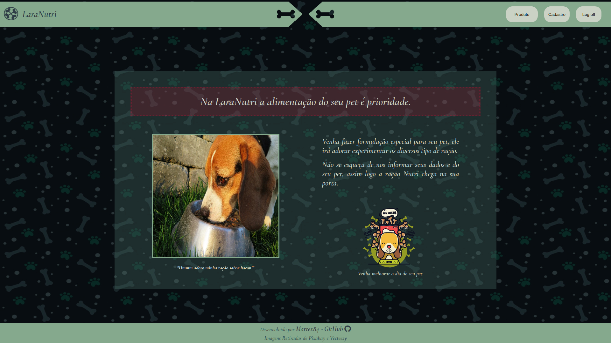
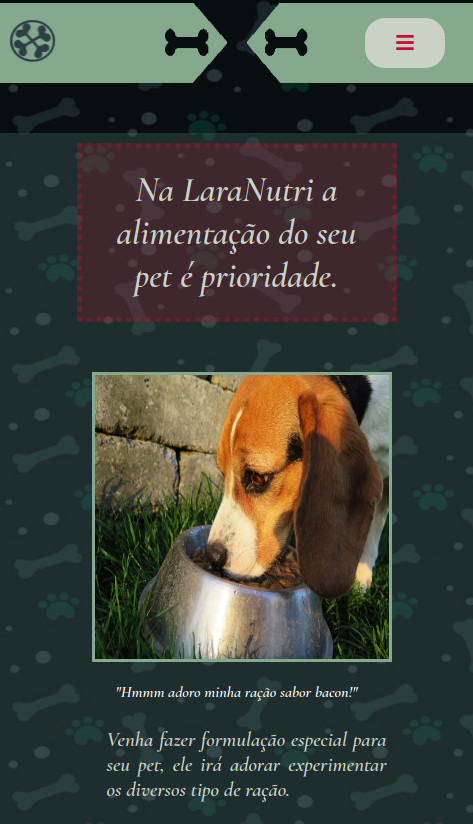

# Descrição Para utilização do Site Lara Nutri - Desafio Gama Academy
 
## Descrição Site
 O site irá realizar a interação entre um cliente desejando comprar rações artesanais para seu pet e o zootecnista responsável por produzir, pegando informações relacionadas ao cliente, necessário para realizar a entrega e do pet, para poder planejar a criação da ração, armazenando todos esses dados dentro do site por meio do local storage.
 
## Divisão e Utilização do Site
 
   O site pode ser dividido em 3 pontos, a home, o cadastro do cliente e o cadastro/ compra da ração requisita, sendo feitos pelos passos a seguir.
 
### Pagina Home
   A página irá conter informações básicas do sistema e o que ele propõe, contendo uma barra superior com logo do sistema e os botões para cadastro, produtos e logoff.
 
   Pontos Principais:
   - Logo responsável por ir para página **Home**;
   - Botão **Produto** responsável para ir na página de **comprar** e **cadastro do pet**;
   - Botão **Cadastro** responsável para ir na página de **cadastro do usuário**;
   - Botão **Log Off** responsável por **apagar** todas as informações do cliente e do pet no sistema;
 
### Pagina Cadastro
   A página irá reunir as informações do cliente que deseja comprar as rações padronizadas, salvando por meio de input e select, para depois ser armazenada no local storage.
 
   Pontos Principais:
   - Todos os inputs são **importantes e necessários**, dessa forma devem ser preenchidos, caso contrário irá apresentar um **alert** ao final do processo;
   - Os inputs não tem restrição de escrita, sendo de responsabilidade do usuário preencher da forma devida;
   - Ao clicar no botão **"Enviar Cadastro"**, o sistema irá verificar se todos inputs foram preenchidos, apresentando um alert caso dê tudo certo ou errado;
   - Com a verificação correta o sistema irá armazenar os dados no local storage como "Cliente" em seu nome e **enviar** o usuário para a **página home**;
   - Caso o usuário tente realizar mais uma vez o cadastro, o sistema irá falar para realizar o **LogOff**
 
### Página Produto
   A página será responsável por reunir a informação sobre o pet e armazenar a escolha de uma ou mais tipos de ração, anexando ao final junto a um **key** do cliente toda a informação no local storage.
 
   Pontos Principais:
   - Da mesma forma que o cadastro do cliente, todos os inputs são **importantes e necessários**;
   - Ao iniciar na página e criado um **Id Aleatório**, sendo utilizado posteriormente para vincular o pet, o tipo de ração e o cliente;
   - A ordem para realizar a compra é feita informando primeiros os valores do pet, já que o campo **quantidade** é anexada junto às informações de ração;
   - O campo **quantidade** e **idade** utilizam valores numéricos;
   - O campo **extra** tem opção para não pedir nada;
   - Toda vez que realizar a compra de uma ração o campo **quantidade** é requerido, dessa forma deve ser mantido preenchido;
   - A compra da ração é feita pelo botão junto ao card que informa o preço por kg e seu sabor, incluindo a espécie que se destina;
   - Da mesma forma que a página cadastro, é alertado por meio de **alert** quando um input não é preenchido;
   - O botão **Enviar Para O Carrinho** armazena os valores no sistema;
   - O sistema irá armazenar no local storage dois tipos de valores:
     - Características do pet, pelo nome **pet-id**;
     - Tipo de ração, pelo nome **Produto-idPet**, sendo que este contém o **id do pet**, junto a **id do produto** e a **id da operação**, sendo ela de forma aleatória;
   - Pode ser realizada a escolha de mais de um sabor para para o pet, podendo ser feito em um único pedido ou resetando á pagina, inicializando do zero, no primeiro caso o campo **Produto-idPet** irá ser atualizado, e não criado um novo, já que é o mesmo pet;
   - Os campos depois de realizar a compra **não são apagados**, permitindo que um mesmo cliente possa **reaproveitar atributos** para outros pet, precisando prestar atenção no que será passado;
   - O botão **Limpar Campos** apaga todos os valores já digitados;
   - Toda vez que a página é carregada é verificado se existe o cadastro do cliente, caso não exista irá apresentar um **alert** na hora da compra, informando para cadastrar, além de toda vez carregar um **id aleatória** para o pet;
   - Toda vez que é realizado a compra é **apagado** a id do pet, criando uma nova logo a seguir;
 
## Outras Observações
   O sistema é responsivo, podendo ser utilizado pelo celular, mas não pode pode apresentar os valores do local storage por problemas do sistema, como o android. Além do fato do sistema apresentar um erro quando é carregado inicialmente de uma das páginas "Cadastro" ou "Produtos", devendo voltar para página "Home" para prosseguir.
  
## Site Do Projeto
   Link Site : [LaraNutri](https://laranutrivendas.netlify.app/)   

## Imagens Site
   **Versão Desktop**
   
   
   **Versão Mobile** 
    
